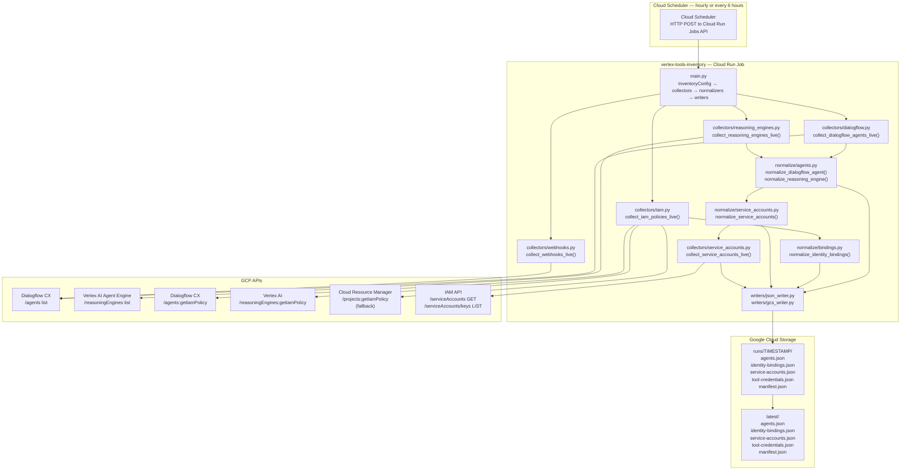

# Vertex Tools Inventory Job — Design Specification

_Version: 1.2_  
_Last updated: 2026-04-19_  

---

## 1. Executive Summary

The Vertex Tools Inventory Job is a scheduled Python batch job that produces
JSON artifact files consumed by the `googlevertexai-connector` OpenICF connector.
Its purpose is to bridge a gap the connector cannot close on its own: determining
who can invoke each AI agent requires calling `getIamPolicy` on every agent
resource and optionally on every project, which is expensive at scale and couples
reconciliation latency to IAM API availability. Doing this live during every IDM
reconciliation would add N+1 IAM API calls per run and require the connector
service account to hold `getIamPolicy` permissions on every agent resource.

The job runs on a schedule (recommended: hourly), collects IAM policies for all
Dialogflow CX agents and Vertex AI Agent Engine reasoning engines across the
configured project and locations, normalizes the bindings against a defined
role-to-permission mapping, and writes five JSON artifacts to Google Cloud
Storage. The connector reads the identity binding and service account artifacts
at reconciliation time instead of making live IAM calls per agent per run.

**What the job is not.** It is not a governance enforcement tool — it makes no
writes to any GCP resource. It is a read-only data collection and normalization
pipeline. Its output is the authoritative source for `agentIdentityBinding` and
`serviceAccount` objects in IGA.

---

## 2. System Context

Two service accounts are involved, each with a distinct identity and distinct
authorization surface.

```
┌───────────────────────────────────────────────────────────────────────────┐
│  Google Cloud Project                                                     │
│                                                                           │
│  ┌────────────────────────────────┐  ┌───────────────────────────────┐   │
│  │ vertex-inventory-job@           │  │ connector-sa@                 │   │
│  │ PROJECT.iam.gserviceaccount.com │  │ PROJECT.iam.gserviceaccount.com│  │
│  │                                 │  │                               │   │
│  │ Permissions:                    │  │ Permissions:                  │   │
│  │  roles/dialogflow.viewer        │  │  roles/dialogflow.reader      │   │
│  │  dialogflow.agents.getIamPolicy │  │  roles/aiplatform.viewer      │   │
│  │  roles/aiplatform.viewer        │  │  cloudasset.assets.            │   │
│  │  aiplatform.reasoningEngines.   │  │    searchAllResources (org)   │   │
│  │    getIamPolicy                 │  │  (no getIamPolicy)            │   │
│  │  roles/iam.securityReviewer     │  │                               │   │
│  │  roles/storage.objectAdmin      │  │                               │   │
│  │    (on inventory bucket)        │  │                               │   │
│  └────────────────────────────────┘  └───────────────────────────────┘   │
└───────────────────────────────────────────────────────────────────────────┘
          │                                          │
          ▼                                          ▼
  ┌────────────────┐  ┌─────────────────────┐  ┌─────────────────┐
  │ Dialogflow CX  │  │ Vertex AI Agent     │  │ Cloud Resource  │
  │ /agents        │  │ Engine              │  │ Manager         │
  │ /agents:       │  │ /reasoningEngines   │  │ /projects:      │
  │  getIamPolicy  │  │ /reasoningEngines:  │  │  getIamPolicy   │
  │                │  │  getIamPolicy       │  │  (fallback)     │
  └────────────────┘  └─────────────────────┘  └─────────────────┘
          │                    │                        │
          └────────────────────┴────────────────────────┘
                               │
                               ▼
                    ┌──────────────────────┐
                    │ Google Cloud Storage │
                    │ (inventory bucket)   │
                    │                      │
                    │ latest/              │
                    │   agents.json        │
                    │   identity-bindings  │
                    │     .json            │
                    │   service-accounts   │
                    │     .json            │
                    │   tool-credentials   │
                    │     .json            │
                    │   manifest.json      │
                    └──────────────────────┘
                               │
                               ▼
                    ┌──────────────────────┐
                    │ googlevertexai-      │
                    │ connector            │
                    │ (OpenICF / PingOne   │
                    │  RCS)               │
                    │                      │
                    │ Reads via pre-signed │
                    │ URL — no auth header │
                    └──────────────────────┘
```

### 2.1 vertex-inventory-job (the job)

A dedicated GCP service account used as the Cloud Run Job execution identity.
It is configured at job creation time via `--service-account`. It acquires GCP
bearer tokens via Application Default Credentials (ADC) on the Cloud Run
infrastructure — no credential files are stored in the container.

The job calls five distinct GCP API surfaces per run: Dialogflow CX (for CX
agents and webhooks), Vertex AI Agent Engine (for reasoning engines), Cloud Resource
Manager (for project-level IAM fallback), and the IAM API (for service account
metadata and key enumeration). All five are accessed with the same
bearer token using the `cloud-platform` scope.

### 2.2 connector-sa (the connector)

A GCP service account used by the OpenICF connector running on the PingOne RCS
host. It acquires bearer tokens by exchanging a service account key JSON via
JWT bearer grant. The connector has no `getIamPolicy` permissions on any
resource — those were removed in OPENICF-4007. It reads GCS artifacts via a
pre-signed URL, which requires no IAM role assignment on the connector SA.

---

## 3. Architecture



---

## 4. Identity Model

### 4.1 vertex-inventory-job — Job Service Account

| Property | Value |
|---|---|
| Identity type | GCP service account (dedicated to the inventory job) |
| Auth method | Application Default Credentials via Cloud Run execution identity |
| Token scope | `https://www.googleapis.com/auth/cloud-platform` |
| Credential storage | None — ADC on Cloud Run; no key file in container |

**Authorization grants required:**

| Surface | Grant | Mechanism | Why |
|---|---|---|---|
| Dialogflow CX | `roles/dialogflow.viewer` | IAM at project level | List agents; read agent metadata |
| Dialogflow CX | `dialogflow.agents.getIamPolicy` | IAM at project level (custom role or predefined) | Resource-level IAM policy collection per agent |
| Vertex AI Agent Engine | `roles/aiplatform.viewer` | IAM at project level | List reasoning engines; read metadata |
| Vertex AI Agent Engine | `aiplatform.reasoningEngines.getIamPolicy` | IAM at project level | Resource-level IAM policy collection per engine |
| Cloud Resource Manager | `roles/iam.securityReviewer` | IAM at project level | Project-level IAM policy reads for project-fallback bindings |
| Google Cloud Storage | `roles/storage.objectAdmin` | IAM on the inventory bucket | Write artifacts to run prefix and `latest/` prefix |
| IAM (service accounts) | `iam.serviceAccounts.list`, `iam.serviceAccounts.get` | IAM at project level | SA metadata enrichment — full SA GET per runtime SA |
| IAM (service account keys) | `iam.serviceAccountKeys.list` | IAM at project level | SA key enumeration per runtime SA |

**Why a dedicated service account.** The job makes `getIamPolicy` calls on
agent resources, which is a sensitive permission not appropriate on the connector
SA. Separation of duties ensures the connector cannot call `getIamPolicy` even
if misconfigured, and the job SA can be granted and audited independently of the
connector SA.

**Why Application Default Credentials.** The job runs on Cloud Run, a GCP-managed
runtime. ADC on Cloud Run authenticates via the Cloud Run execution identity
without any credential file in the container image. This eliminates key rotation
risk and secret storage in the container.

### 4.2 connector-sa — Connector Service Account

| Property | Value |
|---|---|
| Identity type | GCP service account |
| Auth method | JWT bearer exchange (service account key JSON → access token) |
| Token scope | `https://www.googleapis.com/auth/cloud-platform` |
| Credential storage | Service account key JSON stored in PingOne IDM encrypted config |

**Authorization grants required:**

| Surface | Grant | Mechanism | Why |
|---|---|---|---|
| Dialogflow CX | `roles/dialogflow.reader` | IAM at project level | Live agent/tool/KB discovery during reconciliation |
| Vertex AI Agent Engine | `roles/aiplatform.viewer` | IAM at project level | Live reasoning engine discovery during reconciliation |
| Cloud Asset API | `cloudasset.assets.searchAllResources` | IAM at organization level | Org-wide agent discovery (only when `useCloudAssetApi=true`) |
| Google Cloud Storage | None (pre-signed URL) | — | GCS reads are self-authenticated via pre-signed URL |

No `getIamPolicy` permissions on any resource type. These were held by the
connector SA before OPENICF-4007 and were removed when IAM collection moved
to the offline job.

---

## 5. API Call Inventory

### 5.1 Dialogflow CX API

**Base URL:** `https://{location}-dialogflow.googleapis.com/v3`  
**Token scope:** `https://www.googleapis.com/auth/cloud-platform`  
**Authentication:** Bearer token acquired via ADC (`google-auth` library); no `gcloud` CLI dependency  
**Invoked by:** Job via direct HTTP (`requests` + `google-auth`)

---

#### GET /agents (list)

Lists all Dialogflow CX agents in a project and location.

**REST endpoint:**
```
GET https://{location}-dialogflow.googleapis.com/v3/projects/{projectId}/locations/{location}/agents
Authorization: Bearer {adc_token}
```

**Required permission:** `dialogflow.agents.list` (included in `roles/dialogflow.viewer`)

**Scope:** Project

**Per:** Each `(projectId, location)` combination in config

**Error behavior:** HTTP non-2xx → `urllib.error.HTTPError` raised; empty list returned for that `(projectId, location)` pair; run continues with remaining pairs. Pagination: caller follows `nextPageToken` until absent.

**Fields used:**

| Field | Purpose |
|---|---|
| `name` | Full resource name; becomes `resourceName` in `agents.json` |
| `displayName` | Human-readable agent name |
| Last segment of `name` | Short agent ID; becomes `id` in `agents.json` and `agentId` in identity bindings |

---

#### POST /agents/{name}:getIamPolicy

Fetches the resource-level IAM policy for a single Dialogflow CX agent.

**REST endpoint:**
```
POST https://{location}-dialogflow.googleapis.com/v3/{agentResourceName}:getIamPolicy
Authorization: Bearer {adc_token}
Content-Type: application/json

{}
```

**Required permission:** `dialogflow.agents.getIamPolicy`

**Scope:** Project

**Per:** Each discovered Dialogflow CX agent

**Binding precedence:** If this call returns a non-empty policy, the project-level fallback (§5.3) is skipped for this agent.

**Error behavior:** HTTP non-2xx → WARNING logged; no resource-level policy stored for this agent; job falls through to project-level fallback. 404 is expected for some engine types (not all Dialogflow CX agents support resource-level IAM).

---

### 5.2 Vertex AI Agent Engine API

**Base URL:** `https://{location}-aiplatform.googleapis.com/v1`  
**Token scope:** `https://www.googleapis.com/auth/cloud-platform`  
**Authentication:** Bearer token acquired via ADC (`google-auth` library); no `gcloud` CLI dependency  
**Invoked by:** Job via direct HTTP (`requests` + `google-auth`)

---

#### GET /reasoningEngines (list)

Lists all Vertex AI Agent Engine reasoning engines in a project and region.

**REST endpoint:**
```
GET https://{location}-aiplatform.googleapis.com/v1/projects/{projectId}/locations/{location}/reasoningEngines
Authorization: Bearer {adc_token}
```

**Required permission:** `aiplatform.reasoningEngines.list` (included in `roles/aiplatform.viewer`)

**Scope:** Project

**Per:** Each `(projectId, location)` combination in config

**Fields used:**

| Field | Purpose |
|---|---|
| `name` | Full resource name; becomes `resourceName` in `agents.json` |
| `displayName` | Human-readable engine name |
| Last segment of `name` | Short engine ID; becomes `id` in `agents.json` |
| `spec.effectiveIdentity` | GCP-managed SA shared across all RE engines in the project. **Note:** `deploymentSpec.serviceAccount` is not a valid v1 API field (confirmed in live testing). `spec.effectiveIdentity` is returned but not currently read — tracked as RFE-5. `runtimeIdentity` is null for all RE agents in v1. |

---

#### POST /reasoningEngines/{name}:getIamPolicy

Fetches the resource-level IAM policy for a single Vertex AI reasoning engine.

**REST endpoint:**
```
POST https://{location}-aiplatform.googleapis.com/v1/{reasoningEngineResourceName}:getIamPolicy
Authorization: Bearer {adc_token}
Content-Type: application/json

{}
```

**Required permission:** `aiplatform.reasoningEngines.getIamPolicy`

**Scope:** Project

**Per:** Each discovered reasoning engine

**Notes:** 404 from `getIamPolicy` on reasoning engines is expected behavior — the API does not support resource-level IAM on all engine types. When this call returns empty, the job falls through to project-level fallback with `MEDIUM` confidence.

**Error behavior:** HTTP non-2xx → WARNING logged; no resource-level policy stored for this engine; falls through to project-level IAM fallback.

---

### 5.3 Cloud Resource Manager API

**Base URL:** `https://cloudresourcemanager.googleapis.com/v1`  
**Token scope:** `https://www.googleapis.com/auth/cloud-platform`  
**Authentication:** Bearer token acquired via ADC (`google-auth` library); no `gcloud` CLI dependency  
**Invoked by:** Job via direct HTTP (`requests` + `google-auth`)

---

#### POST /projects/{projectId}:getIamPolicy

Fetches the project-level IAM policy. Used as a fallback when a per-agent
`getIamPolicy` call returns an empty policy.

**REST endpoint:**
```
POST https://cloudresourcemanager.googleapis.com/v1/projects/{projectId}:getIamPolicy
Authorization: Bearer {adc_token}
Content-Type: application/json

{}
```

**Required permission:** `resourcemanager.projects.getIamPolicy` (included in `roles/iam.securityReviewer`)

**Scope:** Project

**Per:** Each distinct `projectId` across all collected agents — deduplicated. If 10 agents share the same project, this call is made once for that project.

**Binding precedence:** Bindings derived from this call are tagged `INHERITED_PROJECT_BINDING` with `confidence=MEDIUM`. They are emitted only when the per-agent resource-level call returned empty.

**Error behavior:** HTTP non-2xx → WARNING logged; no project-level bindings emitted for this project.

---

### 5.4 Google Cloud Storage

The job writes five artifacts per run using the `google-cloud-storage` Python
client SDK with the ADC-derived credential. No SAS token or connection string
is used.

**Write (job) — run-specific prefix:**

```
PUT https://storage.googleapis.com/upload/storage/v1/b/{bucket}/o
    ?uploadType=multipart
    &name={prefix}/runs/{timestamp}/{filename}
Authorization: Bearer {storage_token}

{artifact JSON}
```

**Write (job) — latest/ prefix (when `writeLatest=true`):**

```
PUT https://storage.googleapis.com/upload/storage/v1/b/{bucket}/o
    ?uploadType=multipart
    &name={prefix}/latest/{filename}
Authorization: Bearer {storage_token}

{artifact JSON}
```

**Required role on bucket:** `roles/storage.objectAdmin`

Artifacts uploaded per run:

| File | Run prefix | Latest prefix |
|---|---|---|
| `agents.json` | Always | When `writeLatest=true` |
| `identity-bindings.json` | Always | When `writeLatest=true` |
| `service-accounts.json` | Always | When `writeLatest=true` |
| `tool-credentials.json` | Always | When `writeLatest=true` |
| `manifest.json` | Always | When `writeLatest=true` |

The run-specific prefix is written first. `latest/` is updated only after all
four run artifacts are successfully written — there is no partial `latest/`
update.

**Read (connector) — per-artifact pre-signed URLs (OPENICF-4016):**

```
GET {gcsIdentityBindingsUrl}     # connector config property
GET {gcsServiceAccountsUrl}      # connector config property
GET {gcsToolCredentialsUrl}      # connector config property
Accept: application/json
(no Authorization header)
```

Each URL is a full pre-signed GCS URL for a specific artifact object. GCS signs
specific object paths — a single URL cannot cover multiple artifacts. The connector
holds one URL per artifact in `gcsIdentityBindingsUrl`, `gcsServiceAccountsUrl`,
and `gcsToolCredentialsUrl`. The pre-signed URL carries all credentials in its
query string. Sending a Bearer token alongside a pre-signed URL causes GCS to
return `400 InvalidAuthenticationInfo`. No IAM role on the connector SA is required
for GCS reads when using pre-signed URLs.

---

### 5.5 IAM API — Service Account Enrichment

**Base URL:** `https://iam.googleapis.com/v1`  
**Token scope:** `https://www.googleapis.com/auth/cloud-platform`  
**Authentication:** Bearer token acquired via ADC (`google-auth` library); no `gcloud` CLI dependency  
**Invoked by:** `collectors/service_accounts.py` — `collect_service_accounts_live()`

---

#### GET /projects/{projectId}/serviceAccounts/{email}

Fetches full metadata for a single service account.

**REST endpoint:**
```
GET https://iam.googleapis.com/v1/projects/{projectId}/serviceAccounts/{email}
Authorization: Bearer {adc_token}
```

**Required permissions:** `iam.serviceAccounts.list`, `iam.serviceAccounts.get`

**Scope:** Project

**Per:** Each deduplicated SA in `NormalizedServiceAccount` list (one call per unique SA email)

**Error behavior:** HTTP non-2xx → WARNING logged with HTTP status and response body; SA enrichment skipped for this SA; sparse record emitted (`id`, `platform`, `email`, `projectId`, `linkedAgentIds` only).

**Fields used:**

| Field | Purpose |
|---|---|
| `name` | Full SA resource name |
| `displayName` | Human-readable name |
| `description` | Description if set |
| `uniqueId` | GCP numeric unique identifier |
| `oauth2ClientId` | OAuth2 client ID |
| `disabled` | Whether the SA is disabled |
| `createTime` | ISO-8601 creation timestamp |

---

#### GET /projects/{projectId}/serviceAccounts/{email}/keys

Lists all keys for a single service account.

**REST endpoint:**
```
GET https://iam.googleapis.com/v1/projects/{projectId}/serviceAccounts/{email}/keys
Authorization: Bearer {adc_token}
```

**Required permission:** `iam.serviceAccountKeys.list`

**Scope:** Project

**Per:** Each deduplicated SA (one call per unique SA email, after successful SA GET)

**Error behavior:** HTTP non-2xx → WARNING logged; SA metadata included but `keysJson=null`, `keyCount=0`.

**Fields used per key object:**

| Field | Purpose |
|---|---|
| `name` | Full key resource name |
| `keyType` | `USER_MANAGED` or `SYSTEM_MANAGED` |
| `validAfterTime` | Key activation time (ISO-8601) |
| `validBeforeTime` | Key expiry time (ISO-8601) |
| `keyAlgorithm` | e.g. `KEY_ALG_RSA_2048` |

All key types are included (both `USER_MANAGED` and `SYSTEM_MANAGED`). The full key list is serialized as a JSON string and stored in `keysJson`; `keyCount` is the count of items.

---

## 6. IAM Binding Normalization

The job normalizes raw GCP IAM policy bindings into a consistent schema for
downstream connector ingestion. Normalization is applied in `normalize/bindings.py`.

### 6.1 Binding precedence

For each agent, the job applies the following precedence:

| Priority | Source | `sourceTag` | `confidence` |
|---|---|---|---|
| 1 | Resource-level `getIamPolicy` on agent resource (non-empty) | `DIRECT_RESOURCE_BINDING` | `HIGH` |
| 2 | Project-level IAM policy (fallback when resource-level is empty) | `INHERITED_PROJECT_BINDING` | `MEDIUM` |

Once a binding source is selected for an agent, the other source is not used.
A non-empty resource policy fully replaces the project fallback for that agent.

### 6.2 Role → permission mapping

Only roles that map to `invoke` or `manage` are included in identity binding
output. Roles that map only to `read` are included but produce no invoke access
signal. Roles with no mapping produce no binding at all.

| IAM Role | Normalized permissions |
|---|---|
| `roles/dialogflow.client` | `invoke` |
| `roles/aiplatform.user` | `invoke` |
| `roles/viewer` | `read` |
| `roles/dialogflow.viewer` | `read` |
| `roles/aiplatform.viewer` | `read` |
| `roles/owner` | `manage` |
| `roles/editor` | `manage` |
| `roles/dialogflow.admin` | `manage` |
| `roles/aiplatform.admin` | `manage` |

Roles not in this table produce no binding — they are filtered out silently.
Custom roles produce no binding in v1 (the role normalization table does not
cover custom role IDs).

### 6.3 Additional filtering rules

**Self-binding exclusion.** If the IAM member matches the agent's own
`runtimeIdentity` service account, the binding is excluded. This prevents the
agent's own execution identity from appearing as a caller-access principal in IGA.

**Group handling.** Members of the form `group:...` produce bindings with
`expanded=false` and `sourceTag=UNEXPANDED_GROUP`. Group membership expansion
(resolving group members to individuals) is not performed in v1.

**Public principals.** `allUsers` → `principalType=PUBLIC`. `allAuthenticatedUsers`
→ `principalType=AUTHENTICATED_PUBLIC`. Both produce bindings if the role maps
to a known permission.

**Binding ID.** Each binding gets a deterministic ID computed as:
```
ib-{sha1[:16]}  where sha1 = SHA1("{agentId}|{member}|{role}|{scopeResourceName}")
```

This ensures stable UIDs across runs — the same binding always produces the
same `id` regardless of run order.

---

## 7. Runtime Data Flow

The following describes one complete job execution.

**1. Configuration load.**
`main.py` parses `--config` argument pointing to a JSON config file (or
reads `INVENTORY_CONFIG_JSON` environment variable). `InventoryConfig.from_dict()`
validates required fields and resolves `project_ids` from the config or from the
`GOOGLE_CLOUD_PROJECT` environment variable as fallback.

**2. Agent collection.**
For each `(projectId, location)` pair in config:
- If `flavor` includes `dialogflowcx`: `collect_dialogflow_agents_live()` calls
  `GET /projects/{projectId}/locations/{location}/agents` on the Dialogflow CX
  REST API and normalizes each result via `normalize_dialogflow_agent()`.
- If `flavor` includes `vertexai`: `collect_reasoning_engines_live()` calls
  `GET /projects/{projectId}/locations/{location}/reasoningEngines` on the Vertex
  AI REST API and normalizes each result via `normalize_reasoning_engine()`. The
  `deploymentSpec.serviceAccount` field is not a valid v1 API field (confirmed
  in live testing). `runtimeIdentity` is null for all RE agents in v1.
  `spec.effectiveIdentity` is returned but not yet read by the job (RFE-5).

All collected agents are merged into a single list regardless of flavor.

**3. IAM policy collection.**
`collect_iam_policies_live(agents)` iterates the full agent list. For each agent:
- `_collect_resource_policy(agent)` calls `POST {agentResourceName}:getIamPolicy`
  on the appropriate REST API. If the response is non-empty, it is stored in
  `resource_policies` keyed by `agent.resourceName` and the agent is skipped for
  project fallback.
- If the resource policy is empty, the agent's `projectId` is queued for
  project-level fallback. The project policy is fetched once per distinct
  `projectId` via `POST /v1/projects/{projectId}:getIamPolicy` on the Cloud
  Resource Manager API and stored in `project_policies`. Subsequent agents in
  the same project reuse the cached policy.

**4. Identity binding normalization.**
`normalize_identity_bindings(agents, resource_policies, project_policies)` iterates
each agent, selects the appropriate policy (resource first, project fallback),
applies role filtering, self-binding exclusion, and group tagging, and emits one
`NormalizedIdentityBinding` per qualifying IAM member. Binding IDs are computed
deterministically.

**5. Service account normalization and enrichment.**
`normalize_service_accounts(agents)` iterates agents, extracts `runtimeIdentity`,
normalizes to `serviceAccount:{email}` format, deduplicates by
`projects/{projectId}/serviceAccounts/{email}`, and accumulates `linkedAgentIds`
for agents sharing the same SA. In live mode, `collect_service_accounts_live()`
then calls `GET iam.googleapis.com/v1/.../serviceAccounts/{email}` and
`GET .../serviceAccounts/{email}/keys` for each deduplicated SA, and the result
is passed back to `normalize_service_accounts(agents, enrichment=...)` to produce
fully enriched records. SA fetch failures are logged as WARNING and the sparse
record (email + linkedAgentIds only) is emitted.

**6. Warning assembly.**
Three conditions generate manifest warnings:
- No identity bindings were generated.
- At least one agent used the project-level fallback.
- At least one group binding was left unexpanded.

**7. Artifact writing.**
`write_agents_json()`, `write_identity_bindings_json()`, `write_service_accounts_json()`,
`write_tool_credentials_json()`, and `write_manifest_json()` write five files to
`output_dir` (typically `/tmp/out` on Cloud Run).

**8. GCS upload.**
If `bucketName` is configured, `upload_directory_to_gcs()` uploads all five
files to `{bucketPrefix}/runs/{timestamp}/` and, if `writeLatest=true`, also
to `{bucketPrefix}/latest/`. Run prefix is always written first.

---

## 8. Output Schema

### 8.1 `agents.json`

Array of normalized agent objects — one per collected agent regardless of flavor.

```json
[
  {
    "id":             "dfcx-agent-001",
    "platform":       "GOOGLE_VERTEX_AI",
    "flavor":         "dialogflowcx",
    "projectId":      "demo-proj",
    "location":       "us-central1",
    "displayName":    "Support Agent",
    "resourceName":   "projects/demo-proj/locations/us-central1/agents/dfcx-agent-001",
    "sourceType":     "dialogflowcx_agent",
    "runtimeIdentity": null,
    "toolIds":        [],
    "knowledgeBaseIds": [],
    "guardrailId":    null
  },
  {
    "id":             "re-001",
    "platform":       "GOOGLE_VERTEX_AI",
    "flavor":         "vertexai",
    "projectId":      "demo-proj",
    "location":       "us-central1",
    "displayName":    "Planner Engine",
    "resourceName":   "projects/demo-proj/locations/us-central1/reasoningEngines/re-001",
    "sourceType":     "vertex_reasoning_engine",
    "runtimeIdentity": "serviceAccount:re-001@demo-proj.iam.gserviceaccount.com",
    "toolIds":        [],
    "knowledgeBaseIds": [],
    "guardrailId":    null
  }
]
```

**Field nullability rules:**

| Field | Nullable | When null |
|---|---|---|
| `runtimeIdentity` | Yes | Dialogflow CX agents (no deployment SA); Vertex engines without a configured SA |
| `toolIds` | No | Always `[]` in v1 — tool relationship not yet populated by job |
| `knowledgeBaseIds` | No | Always `[]` in v1 |
| `guardrailId` | Yes | Always `null` in v1 |

### 8.2 `identity-bindings.json`

Array of normalized identity binding objects — one per qualifying IAM member per
agent. Empty when no agents have IAM policies with invoke/manage roles.

```json
[
  {
    "id":               "ib-a3f9b21c4d7e8f01",
    "agentId":          "dfcx-agent-001",
    "agentVersion":     "latest",
    "principal":        "alice@example.com",
    "principalType":    "USER",
    "iamMember":        "user:alice@example.com",
    "iamRole":          "roles/dialogflow.client",
    "permissions":      ["invoke"],
    "scope":            "resource",
    "scopeType":        "AGENT_RESOURCE",
    "scopeResourceName": "projects/demo-proj/locations/us-central1/agents/dfcx-agent-001",
    "sourceTag":        "DIRECT_RESOURCE_BINDING",
    "confidence":       "HIGH",
    "kind":             "USER",
    "flavor":           "dialogflowcx",
    "expanded":         true
  },
  {
    "id":               "ib-c7d4e2f1a8b3c901",
    "agentId":          "re-001",
    "agentVersion":     "latest",
    "principal":        "analysts@example.com",
    "principalType":    "GROUP",
    "iamMember":        "group:analysts@example.com",
    "iamRole":          "roles/aiplatform.user",
    "permissions":      ["invoke"],
    "scope":            "project",
    "scopeType":        "PROJECT",
    "scopeResourceName": "projects/demo-proj",
    "sourceTag":        "UNEXPANDED_GROUP",
    "confidence":       "MEDIUM",
    "kind":             "GROUP",
    "flavor":           "vertexai",
    "expanded":         false
  }
]
```

**Field nullability rules:** All fields are non-null. Bindings with unresolvable
members are not emitted — they are skipped with a warning.

### 8.3 `service-accounts.json`

Array of deduplicated runtime service accounts extracted from `runtimeIdentity`
fields. One entry per unique SA email across all agents. All enrichment fields
are populated by the job via live IAM API calls (OPENICF-4009). In v1,
`service-accounts.json` will be empty for RE-only deployments because
`runtimeIdentity` is null for all RE agents (RFE-5).

```json
[
  {
    "id":              "projects/demo-proj/serviceAccounts/re-001@demo-proj.iam.gserviceaccount.com",
    "platform":        "GOOGLE_VERTEX_AI",
    "email":           "re-001@demo-proj.iam.gserviceaccount.com",
    "projectId":       "demo-proj",
    "linkedAgentIds":  ["re-001"],
    "name":            "projects/demo-proj/serviceAccounts/re-001@demo-proj.iam.gserviceaccount.com",
    "displayName":     "Reasoning Engine Runtime SA",
    "description":     "",
    "uniqueId":        "123456789012345678901",
    "oauth2ClientId":  "987654321098765432109",
    "disabled":        false,
    "createTime":      "2025-11-01T08:00:00Z",
    "keysJson":        "[{"name":"projects/demo-proj/serviceAccounts/re-001@.../keys/abc123","keyType":"USER_MANAGED","validAfterTime":"2025-11-01T08:00:00Z","validBeforeTime":"9999-12-31T23:59:59Z","keyAlgorithm":"KEY_ALG_RSA_2048"}]",
    "keyCount":        1
  }
]
```

**Field notes:**

| Field | Nullable | Notes |
|---|---|---|
| `name` | No | Full SA resource name from IAM API |
| `displayName` | Yes | Empty string if not set |
| `description` | Yes | Empty string if not set |
| `uniqueId` | Yes | GCP numeric unique ID |
| `oauth2ClientId` | Yes | OAuth2 client ID |
| `disabled` | No | Defaults to `false` if absent from API response |
| `createTime` | Yes | ISO-8601 creation timestamp |
| `keysJson` | Yes | JSON array; key fields: `name`, `keyType`, `validAfterTime`, `validBeforeTime`, `keyAlgorithm`; includes both `USER_MANAGED` and `SYSTEM_MANAGED` keys |
| `keyCount` | No | Defaults to `0` if SA fetch failed |

If `collect_service_accounts_live()` cannot fetch a SA (HTTP non-2xx), the enrichment fields are absent and the record contains only `id`, `platform`, `email`, `projectId`, and `linkedAgentIds`.

### 8.4 `manifest.json`

Single object describing the run metadata and artifact counts.

```json
{
  "generatedAt":          "2026-04-18T10:00:00Z",
  "schemaVersion":        "1.0",
  "platform":             "GOOGLE_VERTEX_AI",
  "collectionMode":       "live",
  "flavorsIncluded":      ["dialogflowcx", "vertexai"],
  "projectIdsScanned":    ["demo-proj"],
  "locationsScanned":     ["us-central1"],
  "agentCount":           2,
  "identityBindingCount": 2,
  "serviceAccountCount":  1,
  "toolCredentialCount":  3,
  "artifacts": {
    "agents":           {"file": "agents.json",            "count": 2},
    "identityBindings": {"file": "identity-bindings.json", "count": 2},
    "serviceAccounts":  {"file": "service-accounts.json",  "count": 1},
    "toolCredentials":  {"file": "tool-credentials.json",  "count": 3}
  },
  "warnings": [
    "Project-level IAM fallback was used for one or more agents.",
    "Group expansion is not performed in v1."
  ]
}
```

**Warning conditions:**

| Condition | Warning text |
|---|---|
| `len(identity_bindings) == 0` | `"No identity bindings were generated."` |
| Any binding has `scope == "project"` | `"Project-level IAM fallback was used for one or more agents."` |
| Any binding has `expanded == false` | `"Group expansion is not performed in v1."` |

---

## 9. Design Decisions

### Why direct REST calls, not the gcloud CLI

Early design iterations assumed `gcloud` CLI commands for API calls. This was
replaced with direct REST calls via `google-auth` + `requests` for three reasons:

1. **COUPLING-1 eliminated.** `gcloud` not installed in the container caused all
   collectors to return empty silently (subprocess `OSError` swallowed). Direct
   REST raises `urllib.error.HTTPError` explicitly — there is no silent failure path.
2. **Container image size.** Installing the Google Cloud SDK adds ~400 MB to the
   image. Direct REST requires only `google-auth[requests]` and Python's `urllib` (stdlib),
   already available without additional packages.
3. **Testability.** REST calls can be intercepted with `responses`, `httpretty`, or `unittest.mock.patch`.
   Subprocess calls require mocking `subprocess.run` and parsing stdout/stderr.

ADC token acquisition uses `google.auth.default(scopes=["https://www.googleapis.com/auth/cloud-platform"])`
with `google.auth.transport.requests.Request` for refresh. Credentials are acquired once per collector invocation (`google.auth.default()`) and
refreshed per request as needed via `google.auth.transport.requests.Request`.

### Why offline, not live

The connector's `agentIdentityBinding` and `serviceAccount` object classes
require IAM policy data that can only be obtained by calling `getIamPolicy` per
agent resource. Making live `getIamPolicy` calls from within the connector would
require:
1. `getIamPolicy` permissions on every agent resource granted to the connector SA
2. N `getIamPolicy` API calls per reconciliation (one per agent, potentially 50–500)
3. IAM API rate-limit exposure during full reconciliations
4. Coupling reconciliation latency to IAM API availability

The offline job pays this cost on a schedule outside the reconciliation critical
path. The connector's permission footprint is reduced to read-only agent/tool/KB
discovery — no policy inspection required.

### Why the job service account is separate from the connector SA

The job makes `getIamPolicy` calls — a sensitive permission that should not be
held by the connector. Separation of duties ensures the connector cannot inspect
IAM policies even if misconfigured. The job SA can be audited and revoked
independently. If the job SA is compromised, the connector SA and its live
reconciliation capability are not affected.

### Why Application Default Credentials, not a key file

The job runs on Cloud Run, a GCP-managed runtime. ADC on Cloud Run authenticates
via the Cloud Run execution identity without any credential file in the container
image. This eliminates key rotation risk, key storage in container images, and
key expiry risk. A key file is only required on runtimes that are not GCP-managed
(e.g. the PingOne RCS host, which is why the connector uses a key file).

### Why project-level IAM is a fallback, not the primary source

Resource-level IAM bindings are more specific and authoritative than project-level
bindings. A project-level IAM binding gives a principal access to all agents in
the project, not just one — this is important information for IGA but is a weaker
governance signal than a direct resource binding. The job uses resource-level
bindings when available and falls back to project-level only when the resource
has no policy, reflecting the actual GCP authorization model.

### Why group GUIDs are not expanded

Expanding group membership requires Cloud Identity or Google Workspace Directory
API calls, a separate token scope, and additional permissions. It would also
produce a different set of bindings on every run as group membership changes.
The current design emits the group principal as-is and tags it `UNEXPANDED_GROUP`
so downstream IGA processes can handle expansion if desired. This is consistent
with the Copilot Studio connector's approach to group-type principals.

### Why self-bindings are excluded

A Vertex AI reasoning engine's `deploymentSpec.serviceAccount` is the identity
the engine uses when calling downstream systems — it is the engine's execution
identity, not a caller. Including it as an `agentIdentityBinding` would produce
a circular governance relationship: "this SA can invoke the agent that runs as
this SA." This is not a meaningful governance signal and would pollute IGA data.

### Why binding IDs are deterministic hashes

Deterministic IDs allow the connector to perform stable UID-based lookups across
runs without tracking state. The same binding always gets the same `ib-{hash}`
ID regardless of run order, collection timestamp, or order of agents in the
response. This is essential for IDM's reconciliation logic, which relies on
stable UIDs to detect additions and removals between runs.

### Why the blob is overwritten rather than versioned

The connector always wants the most recent successful inventory. There is no
connector use case for reading a previous run's artifacts. The run-specific
prefix (`runs/{timestamp}/`) provides the full audit trail if rollback is needed
operationally. Versioning the `latest/` prefix would add connector complexity
(version selection logic) with no benefit to the reconciliation outcome.

---

## 10. Failure Modes

| Failure | Behavior | Recovery |
|---|---|---|
| `gcloud` not installed in container | N/A — collectors use direct REST via `google-auth`; no `gcloud` dependency. COUPLING-1 eliminated. | — |
| Dialogflow CX `agents list` fails | Empty agent list for that `(projectId, location)`; run continues with remaining pairs | Automatic retry on next scheduled run |
| Vertex AI `reasoning-engines list` fails | Empty engine list for that `(projectId, location)`; run continues | Automatic retry on next scheduled run |
| `getIamPolicy` on agent fails | Empty resource policy; job falls through to project-level fallback; WARNING logged | Recovered on next run if transient; project fallback provides MEDIUM-confidence bindings |
| `projects get-iam-policy` fails | No project-level bindings emitted for that project; WARNING logged | Recovered on next run if transient |
| IAM role not in normalization table | Binding not emitted; silently filtered | Not an error — expected for custom roles and roles not relevant to invoke/manage access |
| GCS upload fails | Exception from storage client; job exits non-zero; Cloud Run marks task failed | Cloud Run retries up to `--max-retries` (recommended: 2); previous `latest/` blob unchanged |
| All agents have empty IAM policies | Empty `identity-bindings.json` written; manifest warning emitted | Not an error — reflects actual state; verify IAM policies are configured on agents |
| Agent's `runtimeIdentity` is null | Agent not included in `service-accounts.json`; no entry emitted | Not an error — CX agents have no deployment SA; RE agents: `deploymentSpec.serviceAccount` is not a valid v1 field so `runtimeIdentity` is always null for RE agents in v1 (RFE-5 tracks `spec.effectiveIdentity` as future source) |
| SA enrichment GET fails (non-2xx) | WARNING logged; sparse record emitted (`id`, `platform`, `email`, `projectId`, `linkedAgentIds` only); enrichment fields absent | Recovered on next run if transient; connector handles absent fields gracefully |
| SA keys LIST fails (non-2xx) | WARNING logged; SA metadata included but `keysJson=null`, `keyCount=0` | Recovered on next run if transient |
| Deleted agent still returned by API | Unlikely — list APIs reflect current state | Not applicable |

**Retry behavior within a run.** There is no retry logic in the Python code for
transient HTTP errors — a failed API call returns an empty result for that agent
or project and the run continues. Job-level retries are provided by Cloud Run's
`--max-retries` setting. Transient failures are recovered on the next scheduled run.

---

## 11. Operational Considerations

**GCS artifact freshness monitoring.** There is no built-in alert on blob age.
Operators should configure a Cloud Monitoring alert that fires when
`manifest.json` `generatedAt` is more than two hours old (two missed runs for
an hourly schedule). Cloud Run Job execution failure alerts cover job crashes but
not silent empty-output runs.

**Schedule alignment.** The job should run before the connector's IDM
reconciliation trigger. A job scheduled at `:00` and a reconciliation scheduled
at `:15` gives 15 minutes of buffer. A sub-hourly reconciliation schedule
requires increasing the job frequency.

**Custom roles produce no bindings.** The role normalization table covers only
GCP predefined roles. Deployments that use custom roles to grant invoke access
to agents will not see those bindings in IGA. Extend `ROLE_PERMISSION_MAP` in
`normalize/roles.py` to add custom role mappings as needed.

**Container image.** The job requires no `gcloud` CLI installation — all GCP API
calls use direct REST via `google-auth` + `requests`. The container image needs
only Python 3.11+ and the packages in `requirements.txt`. ADC is provided
automatically by the Cloud Run execution identity.

**Policy=1 agents produce no bindings.** Agents with Dataverse record-level
security equivalents — or GCP agents whose access control is managed via
conditions rather than plain role bindings — will produce bindings only for
the unconditional IAM roles. Conditional IAM bindings are not evaluated or
filtered; they are included in output as if the condition did not exist, because
the job does not evaluate condition expressions.

**Group expansion not performed.** Bindings for `group:...` principals have
`expanded=false`. Individual group member resolution is not performed in v1. If
IGA requires individual-level resolution, extend `normalize/bindings.py` to call
the Cloud Identity API after collecting all group principals.

**Scale.** The job makes 1 agent-list call + 1 `getIamPolicy` call per agent +
1 project-level IAM call per distinct project per run. For 50 agents across
2 projects: approximately 52 API calls. At 500+ agents, parallel `getIamPolicy`
calls should be considered. The current implementation is serial.

**Pre-signed URL rotation (connector side).** The connector reads GCS artifacts
via three per-artifact pre-signed URLs: `gcsIdentityBindingsUrl`, `gcsServiceAccountsUrl`,
and `gcsToolCredentialsUrl` (OPENICF-4016). GCS signs specific object paths — a single
URL cannot cover multiple artifacts. Operators must generate one signed URL per artifact
using the job SA or a dedicated signing SA with `roles/storage.objectViewer` on the bucket,
and rotate all three before expiry. Recommended URL TTL: 7 days with rotation at 5 days.
A Cloud Scheduler job that regenerates URLs and updates the IDM connector
configuration via the IDM REST API is the recommended rotation approach.
